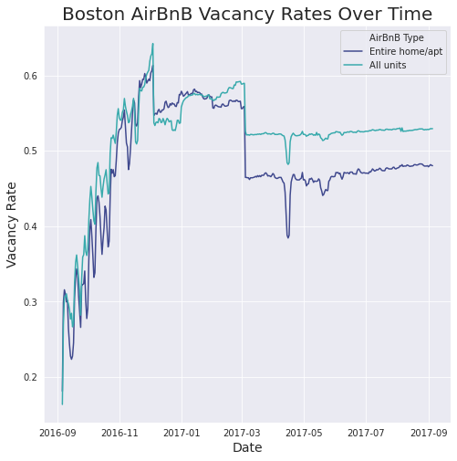

# Creative Title

Airbnb has been under a lot of scrutiny for its impacts on the local rental market, but it's also created an entirely new economy that has brought benefits to many in renting out spare bedrooms. In this post, we'll explore the Boston Airbnb Open Dataset available via [Kaggle](https://www.kaggle.com/airbnb/boston). 

We'll look to answer five questions in particular:
1. How many units are sitting vacant throughout the year, potentially causing detrimental effects to the housing market in Boston?
2. How has the short-term rental economy grown, in terms of number of hosts?
3. How affordable is airbnb compared to a regular rental unit in various neighborhoods?
4. How many units exist away from the city center?
5. How affordable are units further away from the city center?

Let's dive right in!

## What are Airbnb's Vacancy Rates in Boston?
To get a better sense of whether or not Airbnb has a detrimental effect on the regular rental market, it can be helpful to look at the vacancy rates of comparable units.

We can see from this graph that when vacancy rates for Whole Home/Apartment rental units levelled out, they stagnated at around 45% on any given day. **This represents roughly 950 units of the 2,215 whole house/apartment rental units.** Boston has an [average vacancy rate of 3%](https://www.deptofnumbers.com/rent/massachusetts/boston/), meaning that these vacant units could be used to fill in gaps in the regular rental market.

Whether or not Airbnb is to blame for a lower vacancy rate is not possible to tell from this data, but it does ask provoking questions. 

It may be worth exploring some potential trade-offs that make Airbnb more worthwhole. Let's look at the number of hosts benefiting from extra income due to Airbnb.

## How has the Short-Term Rental Market Grown in Boston?
To explore how many new income opportunity Airbnb has generated, we can look at the number of new hosts over time. This still only paints a relatively small picture, as many hosts use third parties to clean and/or manage their properties.

We can see that the number of hosts has grown at a relatively stable pace. While this number is cumulative, many new economic opportunities are being generated every day!

## How do Rental Rates Vary Between Regular Units and Airbnb Units?
Now, let's take a look at the flip side of this argument. Airbnb is generating economic opportunities for hosts - but what impact is it having on affordability?

Airbnb provides the opportunity to offer long-term rental discounts (either by week or by month). The graph below compares rental rates between regular units and Airbnb units, within different Boston neighborhoods:

We can see that Airbnb rates are significantly higher, even when factoring in discounts. 

This neighborhood lens provides an interesting perspective. To close out the article, let's explore how the short-term rental market varies geographically in Boston, both in terms of number of units and average cost for a 1-bedroom unit.

## How do Boston Neighborhoods Vary in Price and Number of Units?
### Price of 1-bedroom units in Boston Neighborhoods
We saw earlier that the price of neighborhoods varied dramatically. Let's see how this looks on a map to see whether or not proximity to downtown or to the airport makes a difference in price:

We can see from this map that proximity to both the downtown core and the airport make a signficant impact in terms of affordability of units. This, of course, makes a ton of sense as that is likely where tourists will want to stay!

Let's see if these trends carry over into the number of units:

### Number of units available to rent in Boston Neighborhoods
In the map below, you can see that the number 
